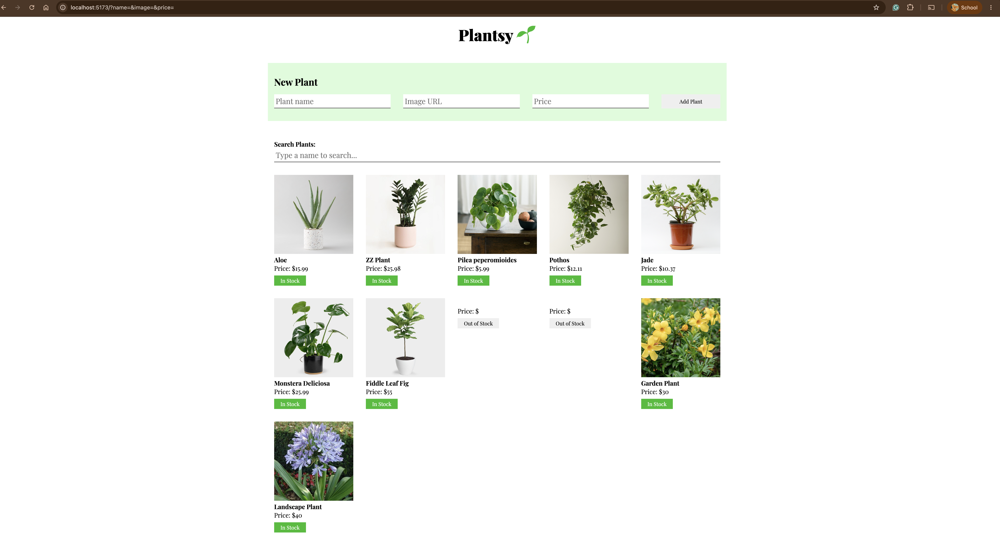

# Plantsy

Plantsy is a React application for managing the admin side of a plant store. It connects to a `json-server` backend to fetch, add, and search for plants, with the ability to toggle a plant's stock status directly on the page.

## Demo


## Features

As a user, you can:

1. View all plants when the app loads.
2. Add a new plant to the page by submitting the form — this sends a `POST` request to the backend and the new plant appears immediately.
3. Mark a plant as "sold out" by clicking its status button. This toggles per plant and does not persist to the backend (resets on page refresh).
4. Search for plants by name and see the list filter in real time. Clearing the search shows the full list again.

## Setup

1. Run `npm install` in your terminal.
2. Run `npm run server`. This will run your backend on port `6001`.
3. In a new terminal, run `npm run dev`.

Make sure to open [http://localhost:6001/plants](http://localhost:6001/plants)
in the browser to verify that your backend is working before you proceed!

## Endpoints

The base URL for your backend is: `http://localhost:6001`

### GET /plants

Example Response:

```json
[
  {
    "id": 1,
    "name": "Aloe",
    "image": "./images/aloe.jpg",
    "price": 15.99
  },
  {
    "id": 2,
    "name": "ZZ Plant",
    "image": "./images/zz-plant.jpg",
    "price": 25.98
  }
]
```

### POST /plants

Required Headers:

```js
{
  "Content-Type": "application/json"
}
```

Request Object:

```json
{
  "name": "string",
  "image": "string",
  "price": number
}
```

Example Response:

```json
{
  "id": 1,
  "name": "Aloe",
  "image": "./images/aloe.jpg",
  "price": 15.99
}
```

## Screenshot


